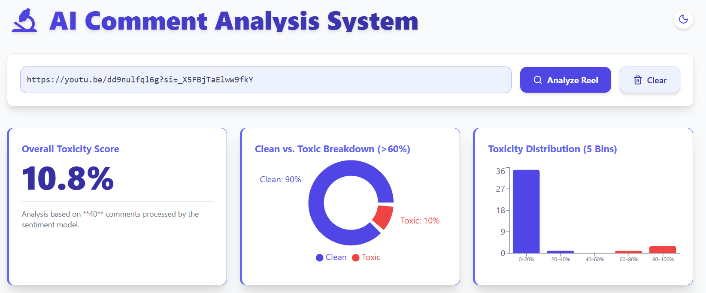
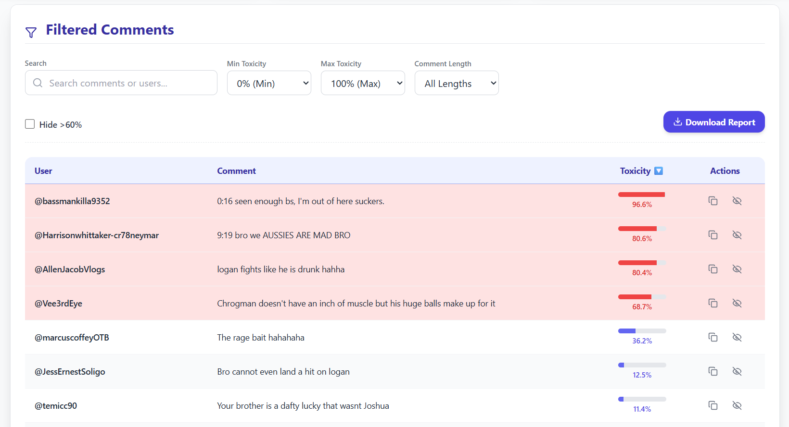
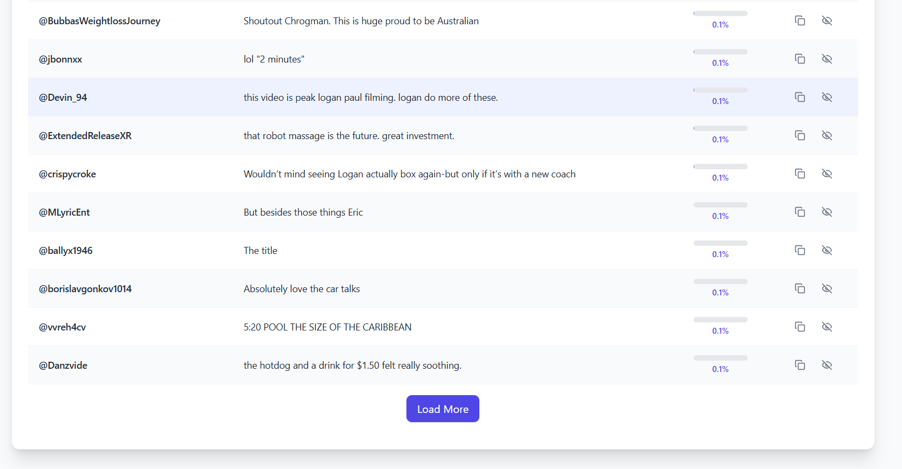

# 🧠 AI Comment Analysis System

An AI-powered web app that detects toxic or harmful comments using NLP models.

## 🚀 Features
- Real-time toxicity detection using Hugging Face model
- Interactive UI built with React + Tailwind
- RESTful backend (Express + Node.js)
- Docker-ready deployment

## 🛠️ Tech Stack
- **Frontend:** React, Vite, Tailwind
- **Backend:** Node.js, Express
- **ML:** Python / Hugging Face Transformers
- **Deployment:** Render / Docker

## 📸 Screenshots

### 🔍 Comment Analysis


### ⚠️ Toxic Comment Detection


### ✅ Clean Comment Result



## 🧩 Setup
```bash
git clone https://github.com/harshkaushik-ai/AI-Comment-Analysis-System.git
cd backend
npm install
cd ../frontend
npm install


